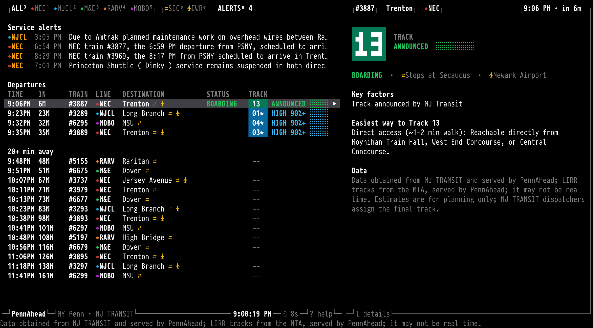

# PennAhead CLI

NJ TRANSIT track estimates at New York Penn Station, in your terminal: the departure board and train
details from [pennahead.com](https://pennahead.com), full screen with vim keys.



PennAhead is an independent service, not affiliated with or licensed by NJ TRANSIT® or Amtrak®.
Tracks marked `*` are estimates and can be wrong; NJ TRANSIT can change a track at any time. Always
check the official station displays before boarding.

## Install

You need [Node.js](https://nodejs.org) 22 or newer (20.19+ works too). Check with `node -v`; on a Mac
without Node, `brew install node`. Works on macOS and Linux.

```sh
mkdir -p ~/.local/bin
curl -fsSL https://raw.githubusercontent.com/the2ndday/pennahead-cli/main/penn -o ~/.local/bin/penn
chmod +x ~/.local/bin/penn
penn
```

If you get `penn: command not found`, add `~/.local/bin` to your PATH, then open a new terminal:

| Shell | Command |
|---|---|
| zsh (the macOS default) | `echo 'export PATH="$HOME/.local/bin:$PATH"' >> ~/.zshrc` |
| bash | `echo 'export PATH="$HOME/.local/bin:$PATH"' >> ~/.bashrc` |
| fish | `fish_add_path ~/.local/bin` |

**Update:** run the `curl` line again. **Uninstall:** `rm ~/.local/bin/penn` (and `rm -r ~/.config/pennahead`).

## Use

```sh
penn              # the board, full screen (press ? for the keys)
penn 3861         # opens train #3861
penn -1 -l nec    # prints the NEC board once and exits
penn --json       # the data as JSON
penn --help       # all options
```

The list is on the left and the selected train (or service alert) on the right; on a terminal
narrower than 120 columns it's one column at a time. It refreshes every 10 seconds.

| Keys | |
|---|---|
| `j` / `k`, `↓` / `↑` | next / previous train (in the details: scroll) |
| `gg` / `G` | first / last |
| `Ctrl-d` / `Ctrl-u`, `Ctrl-f` / `Ctrl-b` | half a page / a page down and up |
| `l`, `Enter`, `Tab` / `h`, `Esc` | to the details / back to the list (also `Ctrl-w l` / `Ctrl-w h`) |
| `J` / `K` | next / previous train from the details |
| `0`, `1`–`5` | all lines; NEC, NJCL, M&E, RARV, MOBO (toggle) |
| `s` / `e` | only trains stopping at Secaucus (⇄) / Newark Airport (✈) |
| `a` | show or hide service alerts (the count is red while some are new) |
| `/text`, `n` / `N` | find a train number or destination; next / previous match |
| `:3861`, `:q` | open train #3861; quit |
| `r`, `?`, `q` | refresh now, help, quit |

| Options | |
|---|---|
| `-l, --line <lines>` | NEC, NJCL, M&E (or ME), RARV, MOBO; comma-separated |
| `--sec`, `--ewr` | only trains stopping at Secaucus / Newark Airport |
| `-a, --alerts` | with `--once`: print the service alerts' full text |
| `-1, --once` | print once and exit (the default when the output isn't a terminal) |
| `--json` | print the data (filtered) as JSON |
| `-i, --interval <s>` | refresh every `<s>` seconds (10 at the least) |
| `--ascii`, `--no-color` | plain ASCII lines and bars; no colors (also `NO_COLOR=1`) |
| `--url <url>` | another PennAhead server (or `PENNAHEAD_URL`) |

Your terminal needs UTF-8 and a font with box-drawing and braille characters (any modern terminal
font). If something shows as boxes, use `--ascii`.

## How it works

- It reads `https://pennahead.com/api/departures`: the same departures, estimates, reasoning and
  service alerts the website shows. It doesn't contact NJ TRANSIT or the MTA itself, and it
  calculates nothing; it only formats what PennAhead serves. How the estimates are made:
  [pennahead.com/faq](https://pennahead.com/faq).
- No account. Requests carry the usual IP address and a `PennAhead-CLI/<version>` User-Agent; see
  [pennahead.com/privacy](https://pennahead.com/privacy).
- It saves one small file, `~/.config/pennahead/seen-alerts.json` (or under `$XDG_CONFIG_HOME`): the
  IDs of service alerts you've already seen, so the alert count isn't red again on every start.

Data obtained from NJ TRANSIT and served by PennAhead; LIRR tracks from the MTA, served by PennAhead;
it may not be real time. Estimates are for planning only; NJ TRANSIT dispatchers assign the final
track. See [data sources and attribution](https://pennahead.com/terms#data-sources).

## Feedback

Open an issue, or email [hello@pennahead.com](mailto:hello@pennahead.com).

## License

[MIT](LICENSE). This repository holds the terminal client only; NJ TRANSIT® and Amtrak® are
trademarks of their owners.
